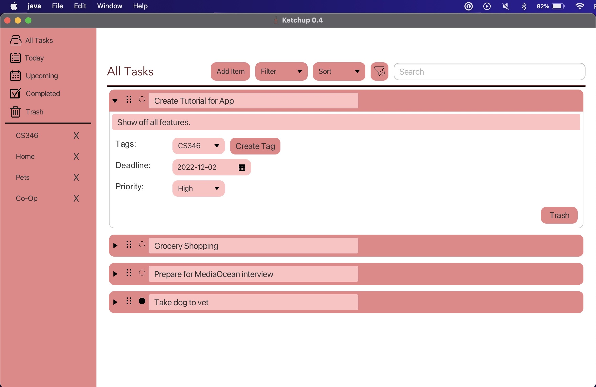

## CS346 Project

Check out our project [Wiki](https://git.uwaterloo.ca/a23dhing/cs346-project/-/wikis/home) for more details!

## Home
Introducing Ketchup, a revolutionary desktop to-do app!

As the developers of this app, we wanted to create the best to-do app on the market, covering all essential features, and more!\
The basics of the app include adding, editing, and deleting a task - create and add descriptions, deadlines, tags, and priorities for your todo items!\
Completed a certain task? Good job! Mark tasks as "completed" and have them accessible in the "Completed" tasks section.\
Deleted a task but changed your mind? No worries - head to the trash folder to restore a previously deleted item!

Check out our in depth <a href="https://git.uwaterloo.ca/a23dhing/cs346-project/-/wikis/App%20Tutorial" target="_blank">tutorial and walkthrough</a>, and visit out project <a href="https://git.uwaterloo.ca/a23dhing/cs346-project/-/wikis/home" target="_blank">Wiki</a> for more details.

## Authors
- Aryaman Dhingra
- Arshvir Chauchary
- Rishad Luthra
- Ryan Bae

## License

This software is distributed under an MIT [license](https://git.uwaterloo.ca/a23dhing/cs346-project/-/blob/main/LICENSE.txt).

## Third-party Libraries

- [JavaFX Framework](https://openjfx.io/)

## Acknowledgment
- Jeff Avery, Yiping Wang, and the CS346 course staff

